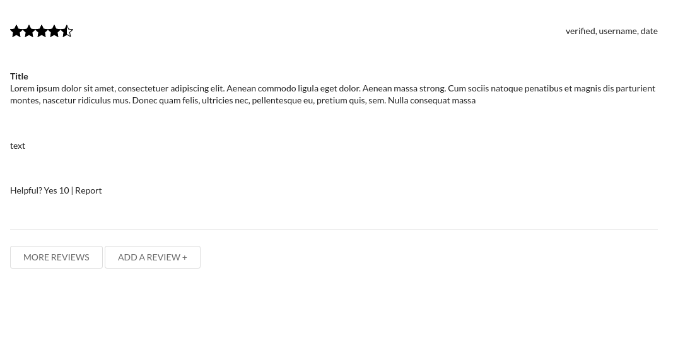

# June 10, 2021

## 8:00AM - ReviewList has hard coded data, it needs to render the reviews dynamically

### Challenge/Motivation
ReviewList is my last component, right now all the data is hard coded. I have the reviews from the database, I need to render them to the list.

### Actions Taken
1. Using the native map method, render reviews into the review list. Reviews are formatted according to business requirements.
2. Hardcode the data at first and work on formatting and styling.
- Hardcoded list:

3. When everything is styled properly, refactor so that the displayed data is from the database and not hardcoded.
- Dynamic list:

### Results Observed
Getting everything to line up properly using Semantic UI React was a bit tricky. I found that the padding is set to have a specific left and right margin (14px) and everything else is set based on the width of it's parent component. Once I figured out *how* semantic was set up, I was able to add minimal styling of my own to make sure everything lined up correctly. This task took the entire day.

